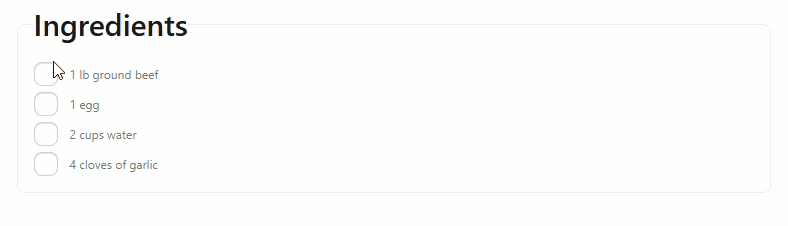

# Project Name: Thatix (Recipe Sharing Platform)

This is the frontend application for Thatix. It provides a modern, responsive user interface where users can create, manage, discover, and like recipes and enjoy a smooth user experience.

## Demo Video:

https://github.com/user-attachments/assets/27faf488-667d-40d0-b876-848019a7c54e

## Live Links: 

- client: https://web-project-27-client-v2-ts.netlify.app/
- server: https://web-project-27-server-v1-monolithic.onrender.com

## Repository links: 

- client: https://github.com/muhammad-tamim/web-project-27-client-v2-ts
- server: https://github.com/muhammad-tamim/web-project-27-server-v1-monolithic-architecture

## Technologies Used:

### Frontend: 

- TypeScript
- React.js
- React Router
- Axios
- firebase auth
- Tailwind CSS
- DaisyUI
- Swiper.js

### Backend: 

- Node.js
- Express
- MongoDB
- dotenv
- cors

## Features:

- Create, update, and delete recipes
- View all recipes
- Like recipes
- Get top 6 most liked recipes
- Filter recipes by category
- Filter recipes by cuisine
- View recipes created by a specific user
- Responsive design for all screen sizes

## What I Learned: 

1. How to make a array by just a number: 

```jsx
import { Swiper, SwiperSlide } from 'swiper/react';
import { Autoplay, Pagination, Navigation } from 'swiper/modules';

import 'swiper/css';
import 'swiper/css/pagination';
import 'swiper/css/navigation';
// import './styles.css';

import image1 from '../../../assets/images/baked-chicken-breast.jpg'
import image2 from '../../../assets/images/chicken-tikka-masala.jpg'
import image3 from '../../../assets/images/burger.jpg'
import image4 from '../../../assets/images/raspberry.jpg'
import { FaStar } from 'react-icons/fa';

const slideItems = [
    { id: 1, title: 'Baked Chicken Breast', image: image1, rating: 4, description: 'A handful of simple ingredients typify the fresh, vibrant flavors of Greek cooking Lorem ipsum dolor sit amet..' },
    { id: 2, title: 'Chicken Tikka Masala', image: image2, rating: 5, description: 'A handful of simple ingredients typify the fresh, vibrant Lorem ipsum dolor sit amet. flavors of Greek cooking.' },
    { id: 3, title: 'Ultimate Cheese Burger', image: image3, rating: 4, description: 'A handful of simple ingredients Lorem ipsum dolor sit amet. typify the fresh, vibrant flavors of Greek cooking.' },
    { id: 4, title: 'Raspberry Tartlet', image: image4, rating: 3, description: 'A handful Lorem ipsum dolor sit amet. of simple ingredients typify the fresh, vibrant flavors of Greek cooking.' },
]

const Hero = () => {
    return (
        <Swiper
            slidesPerView={2} spaceBetween={30} pagination={{ clickable: true }} loop={true} navigation={true}
            modules={[Pagination, Navigation, Autoplay]} autoplay={{ delay: 2500, disableOnInteraction: false, }}>
            {slideItems.map((item) => (
                <SwiperSlide key={item.id}>
                    <div className='relative h-[500px]'>
                        

                        {/* Black overlay */}
                        <div className="absolute inset-0 bg-black/60"></div>

                        <div className='absolute inset-0 text-center flex flex-col justify-center items-center gap-5'>
                            <div className='flex gap-1 items-center'>
                                {[...Array(item.rating)].map((_, index) => (
                                    <FaStar key={index} className='text-[#f89223]' />
                                ))}
                            </div>
                            <h1 className='text-white font-bold text-5xl'>{item.title}</h1>
                            <p className='text-white max-w-md'>{item.description}</p>
                        </div>
                    </div>
                </SwiperSlide>
            ))}

        </Swiper>
    );
};

export default Hero;
```

2. How to make a black overlay: 

```tsx
import { Swiper, SwiperSlide } from 'swiper/react';
import { Autoplay, Pagination, Navigation } from 'swiper/modules';

import 'swiper/css';
import 'swiper/css/pagination';
import 'swiper/css/navigation';
// import './styles.css';

import image1 from '../../../assets/images/baked-chicken-breast.jpg'
import image2 from '../../../assets/images/chicken-tikka-masala.jpg'
import image3 from '../../../assets/images/burger.jpg'
import image4 from '../../../assets/images/raspberry.jpg'
import { FaStar } from 'react-icons/fa';

const slideItems = [
    { id: 1, title: 'Baked Chicken Breast', image: image1, rating: 4, description: 'A handful of simple ingredients typify the fresh, vibrant flavors of Greek cooking Lorem ipsum dolor sit amet..' },
    { id: 2, title: 'Chicken Tikka Masala', image: image2, rating: 5, description: 'A handful of simple ingredients typify the fresh, vibrant Lorem ipsum dolor sit amet. flavors of Greek cooking.' },
    { id: 3, title: 'Ultimate Cheese Burger', image: image3, rating: 4, description: 'A handful of simple ingredients Lorem ipsum dolor sit amet. typify the fresh, vibrant flavors of Greek cooking.' },
    { id: 4, title: 'Raspberry Tartlet', image: image4, rating: 3, description: 'A handful Lorem ipsum dolor sit amet. of simple ingredients typify the fresh, vibrant flavors of Greek cooking.' },
]

const Hero = () => {
    return (
        <Swiper
            slidesPerView={2} spaceBetween={30} pagination={{ clickable: true }} loop={true} navigation={true}
            modules={[Pagination, Navigation, Autoplay]} autoplay={{ delay: 2500, disableOnInteraction: false, }}>
            {slideItems.map((item) => (
                <SwiperSlide key={item.id}>
                    <div className='relative h-[500px]'>
                        

                        {/* Black overlay */}
                        <div className="absolute inset-0 bg-black/60"></div>

                        <div className='absolute inset-0 text-center flex flex-col justify-center items-center gap-5'>
                            <div className='flex gap-1 items-center'>
                                {[...Array(item.rating)].map((_, index) => (
                                    <FaStar key={index} className='text-[#f89223]' />
                                ))}
                            </div>
                            <h1 className='text-white font-bold text-5xl'>{item.title}</h1>
                            <p className='text-white max-w-md'>{item.description}</p>
                        </div>
                    </div>
                </SwiperSlide>
            ))}

        </Swiper>
    );
};

export default Hero;
```

3. How to change swiper.js left and right arrow and pagination bullet color: 

```css
.swiper-button-next,
.swiper-button-prev {
    color: #f89223;
}


/* Pagination bullets color */
.swiper-pagination-bullet {
    background-color: #f89223;
}
```

4. How to make todo using tailwind: 



- peer → peer marks an element as a reference
- peer-checked:line-through → When the peer checkbox is checked, apply these styles
- line-through → middle underline

```jsx
<fieldset className="fieldset bg-base-100 border-base-300 rounded-box w-full border p-4">
    <legend className="fieldset-legend text-3xl font-medium">Ingredients</legend>

    <label className="label cursor-pointer flex gap-3">
        <input type="checkbox" className="checkbox peer" />
        <span className="peer-checked:line-through peer-checked:text-gray-400">
            1 lb ground beef
        </span>
    </label>

    <label className="label cursor-pointer flex gap-3">
        <input type="checkbox" className="checkbox peer" />
        <span className="peer-checked:line-through peer-checked:text-gray-400">
            1 egg
        </span>
    </label>

    <label className="label cursor-pointer flex gap-3">
        <input type="checkbox" className="checkbox peer" />
        <span className="peer-checked:line-through peer-checked:text-gray-400">
            2 cups water
        </span>
    </label>

    <label className="label cursor-pointer flex gap-3">
        <input type="checkbox" className="checkbox peer" />
        <span className="peer-checked:line-through peer-checked:text-gray-400">
            4 cloves of garlic
        </span>
    </label>
</fieldset>
```

## Challenges I faced:
1. To making the hero slider: 
here, 
   - inset-0 in means: top: 0; right: 0; bottom: 0; left: 0;

```tsx
import { Swiper, SwiperSlide } from 'swiper/react';
import { Autoplay, Pagination, Navigation } from 'swiper/modules';

import 'swiper/css';
import 'swiper/css/pagination';
import 'swiper/css/navigation';
// import './styles.css';

import image1 from '../../../assets/images/baked-chicken-breast.jpg'
import image2 from '../../../assets/images/chicken-tikka-masala.jpg'
import image3 from '../../../assets/images/burger.jpg'
import image4 from '../../../assets/images/raspberry.jpg'
import { FaStar } from 'react-icons/fa';

const slideItems = [
    { id: 1, title: 'Baked Chicken Breast', image: image1, rating: 4, description: 'A handful of simple ingredients typify the fresh, vibrant flavors of Greek cooking Lorem ipsum dolor sit amet..' },
    { id: 2, title: 'Chicken Tikka Masala', image: image2, rating: 5, description: 'A handful of simple ingredients typify the fresh, vibrant Lorem ipsum dolor sit amet. flavors of Greek cooking.' },
    { id: 3, title: 'Ultimate Cheese Burger', image: image3, rating: 4, description: 'A handful of simple ingredients Lorem ipsum dolor sit amet. typify the fresh, vibrant flavors of Greek cooking.' },
    { id: 4, title: 'Raspberry Tartlet', image: image4, rating: 3, description: 'A handful Lorem ipsum dolor sit amet. of simple ingredients typify the fresh, vibrant flavors of Greek cooking.' },
]

const Hero = () => {
    return (
        <Swiper
            slidesPerView={2} spaceBetween={30} pagination={{ clickable: true }} loop={true} navigation={true}
            modules={[Pagination, Navigation, Autoplay]} autoplay={{ delay: 2500, disableOnInteraction: false, }}>
            {slideItems.map((item) => (
                <SwiperSlide key={item.id}>
                    <div className='relative h-[500px]'>
                        

                        {/* Black overlay */}
                        <div className="absolute inset-0 bg-black/60"></div>

                        <div className='absolute inset-0 text-center flex flex-col justify-center items-center gap-5'>
                            <div className='flex gap-1 items-center'>
                                {[...Array(item.rating)].map((_, index) => (
                                    <FaStar key={index} className='text-[#f89223]' />
                                ))}
                            </div>
                            <h1 className='text-white font-bold text-5xl'>{item.title}</h1>
                            <p className='text-white max-w-md'>{item.description}</p>
                        </div>
                    </div>
                </SwiperSlide>
            ))}

        </Swiper>
    );
};

export default Hero;
```

## Limitation:
- No role-based authorization on the frontend
- No Dashboard

## Contact: 

Email: contact2tamim@gmail.com | LinkedIn: https://www.linkedin.com/in/tamim-muhammad

--- 

If you like this project, feel free to give it a star ⭐!