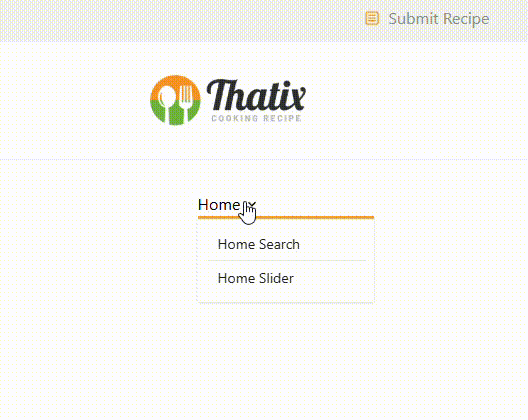

<!-- ## What Problem I Solve By This Project:  -->
## Project Name:

## Project Description:

## Project Live Demo Video:

## Live Site Link: 

https://web-project-26.netlify.app/news/1

## Technologies Used:

## Features:

## What I Learned: 

1. How to use group class on hover: 



```tsx
import { GoDotFill } from "react-icons/go";
import { MdOutlineKeyboardArrowDown } from "react-icons/md";
import { Link, NavLink } from "react-router";

const NavLinks = () => {
    return (
        <div>
            <div className="dropdown dropdown-hover">
                <NavLink to={'/'} className={({ isActive }) => isActive ? 'text-black flex items-center gap-1' : 'text-[#8c8e91] flex items-center gap-1'} tabIndex={0} role="button">
                    <span className="hover:text-black">Home</span>
                    <span className="hover:text-black"><MdOutlineKeyboardArrowDown /></span>
                </ NavLink>
                <ul tabIndex="-1" className="dropdown-content border-t-3 border-t-[#f79e23] menu bg-base-100 z-1 w-44 p-2 shadow-sm">
                    <li className="group border-b border-[#eae9e7]">
                        <Link to={'/homeSearch'}>
                            <span className="hidden group-hover:block group-hover:text-[#f79e23]"><GoDotFill /></span>
                            <span>Home Search</span>
                        </Link>
                    </li>
                    <li className="group">
                        <Link to={'/'}>
                            <span className="hidden group-hover:block group-hover:text-[#f79e23]"><GoDotFill /></span>
                            <span>Home Slider</span>
                        </Link>
                    </li>
                </ul>
            </div>
        </div>
    );
};

export default NavLinks;
```

## Challenges I faced:

## Limitation:

## Contact: 

tamim.muhammad2005@gmail.com | https://www.linkedin.com/in/tamim-muhammad
 